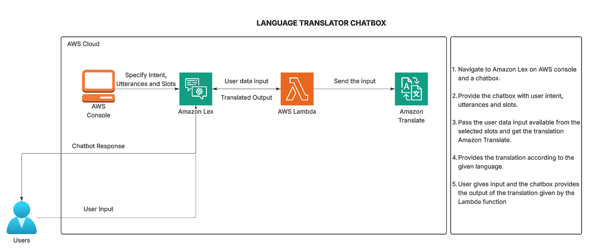
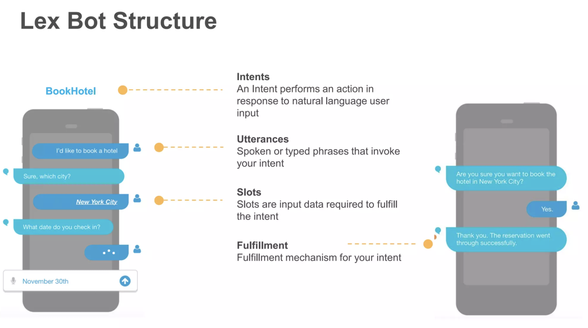
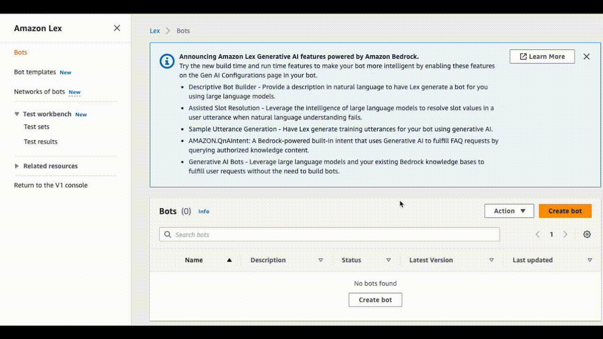
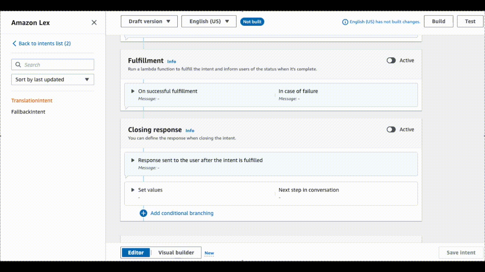
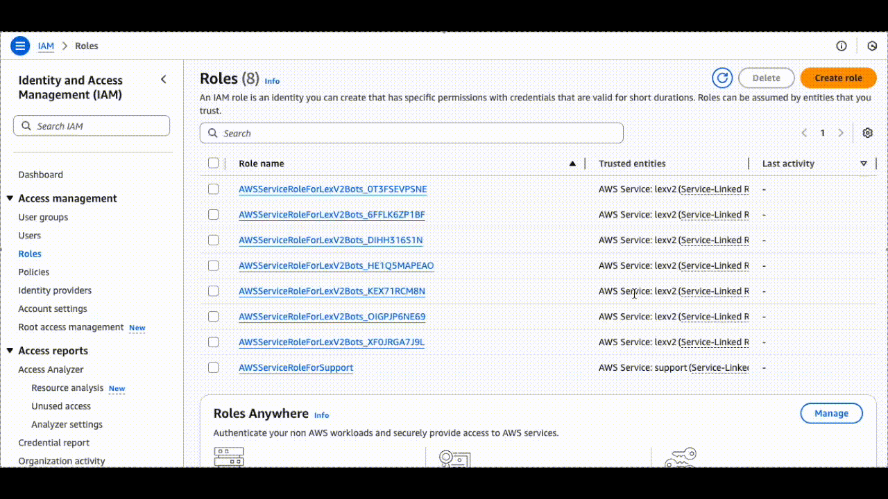
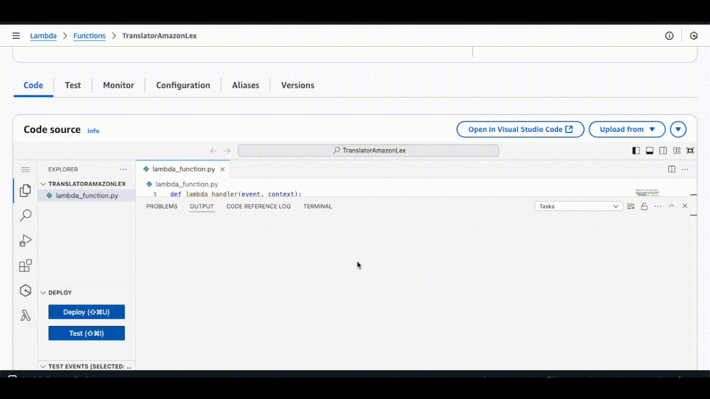
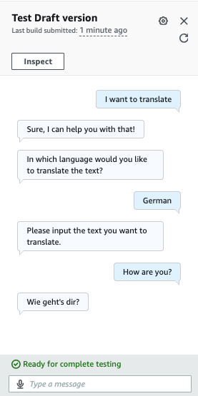

# 🌐 Building a Language Translation Bot using Amazon Lex

## Project Overview ☁️

In this project, we'll be building a **language translation bot using Amazon Lex**.

**Goal:** Translate a word or sentence into another language simply by typing it into the chatbot.

### Steps to be performed 👩‍💻

1.  Create an empty chatbot
2.  Specify intents and slots
3.  Specify fulfilment
4.  Create an IAM role
5.  Create a Lambda function
6.  Test the Lambda function
7.  Test the chatbot

### Services Used 🛠

- **Amazon Lex:** Build the chatbot and define conversation flow
- **AWS Lambda:** Process translation requests
- **AWS IAM:** Secure access by managing permissions
- **Amazon Translate:** Translate text according to input language

### Estimated Time & Cost ⚙️

- **Time:** 1-2 hours
- **Cost:** Free (AWS Free Tier)

➡️ **Diagram:**

---

## Specify Intents and Slots 🎯

### Key Terms

- **Intent:** User goal
- **Utterance:** User input
- **Slot:** Variable extracted from input
- **Fulfilment:** Chatbot action/response

**Example in Amazon Lex Documentation:**

- Hotel Booking Chatbot: Intent = BookHotel, Utterance = "book a hotel", "new york", "November", Slots = City, CheckInDate, Fulfillment = confirmation message

---

## Now Let's Create our Language Translator Bot

---

### Create an empty chatbot

1.  Login to your AWS management console and navigate to Amazon Lex from the search bar.
2.  Click on ‘Create Bot’.
3.  In the Creation method, go with ‘Create a blank bot’.
4.  Give the chatbot a suitable name and description.
5.  Click Next and Done.

---

## Specify Intents and Slots

1.  In the Intent details, fill in an appropriate Intent name and description.
2.  Add sample utterances.
3.  Add custom slots - Click on back to Intents list and navigate to slot type, add Slot type.
4.  Click on Save slot type.
5.  Navigate back to the Intents to use this slot type for our slot.
6.  Click on Add Slot. Give the slot name and choose the slot type ‘language’ previously made. Write the prompt where the chatbot asks for user choice for language translation.
7.  Create another slot ‘text’ which takes the text to be translated as an input. Choose AMAZON.FreeFormInput as the slot type option and enter a suitable prompt asking for the text to be translated. Click on Add.
8.  We can add some more utterances specifying the Slots.
    - For example : Instead of ‘I want to translate’ , if user inputs ‘I want to translate to French’ with the language specified in the starting intent itself, it should not ask for the language again by running the language prompt.
    - This will automatically understand the language slot type if already specified and ask for the input text to be translated directly.
9.  We can also add an Initial response to the initial intent as a feedback message.

---

## Specify Fulfilment

1. Fulfilment runs the Lambda function to fulfil the intent and informs users about it’s status once it is complete.
2. Write a suitable prompt on successful fulfilment and in case of a failure.
3. Click on ‘Advanced Options’ and check ‘Use a Lambda function for fulfilment’. Click on update options.
4. We can also provide a Closing message after completion of the intent.
5. Click on ‘Save Intent’.

We have setup the conversation flow of our chatbot. Next, we will proceed to creating the Lambda function for actual serverless text translation.

---

## Create an IAM Role

1.  From your AWS management console, navigate to IAM from your search bar
2.  Navigate to roles and Create Role. This role will be used for the Lambda function to provide basic Lambda execution permissions and access to Amazon Translate.
3.  Select the trusted entity type as AWS service and select Lambda as the use case. Click on Next.

    - `TranslateFullAccess`
    - `AWSLambdaBasicExecutionRole`

4.  Click on Next. Enter a suitable name and description for the role and Create Role.
5.  This role will be used for the Lambda function permission.

---

## Create a Lambda Function

1.  Navigate to **Lambda** → **Create Function**
2.  Name the function, choose **Python 3.12 runtime**
3.  Assign previously created **IAM role**
4.  Creating Lambda code:

5.  Click **Deploy**.

---

## Test the Lambda Function

1.  Click **Test** → **Configure Test Event**
2.  Use event JSON format:

3.  Save → Test → Lambda outputs JSON formatted response for Lex

---

## Test the Chatbot

1.  Navigate to **Intent page** of the chatbot
2.  Click **Settings** → choose **Lambda function source**
3.  Test conversations with phrases to translate into selected languages

---

➡️ **Final Result:** _(Insert screenshot or description of completed chatbot)_

---

## Conclusion & Clean-up

### Conclusion

- Congratulations! Explore adding new languages or integrating the bot on a website

### Clean-up

1.  Delete chatbot: **Amazon Lex → Select Bot → Action → Delete**
2.  Delete Lambda function: **Lambda → Select function → Actions → Delete**
3.  Delete IAM role: **IAM → Select role → Delete**

---
